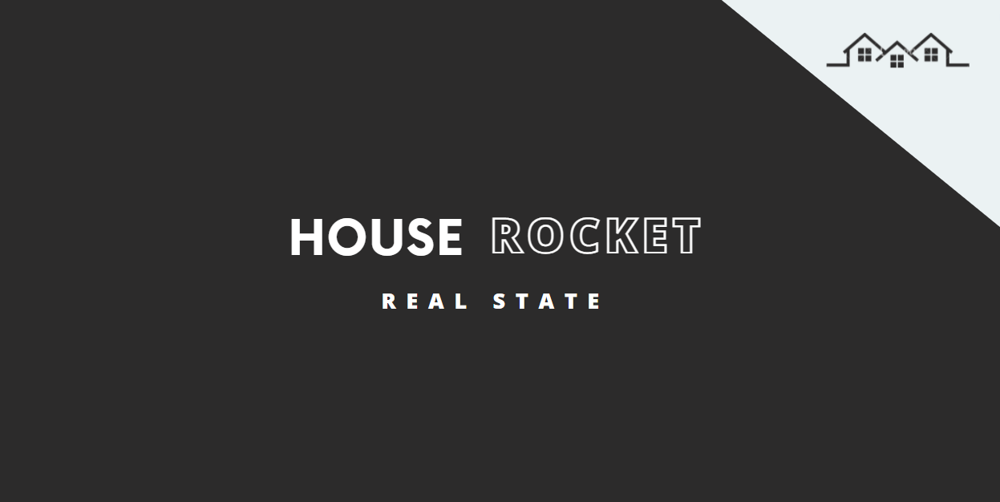

<p align="center">
  
  
  
  
</p>

💻 Conteúdos
=================
  * 🏠 [Sobre o projeto](#-sobre-o-projeto)
  * 🚀 [Como executar](#-como-executar)
  * ❓  [Questão de negócio](#-questao-de-negócio)
  * ♟️ [Premissa de negócio](#-premissa-de-negócio)
  * 📝 [Planejamento da solução](#-planejamento-da-solução)
  * 💡  [5 principais insights nos dados](#-5-principais-insights-nos-dados)
  * 💰  [Resultados financeiros para o negócio](#-resultados-financeiros-para-o-negócio)
  * ✅  [Conclusão](#-conclusão)
  * 🦸 [Autor](#-autor)

---

## 🏠 Sobre o projeto
[House Rocket Real State](https://house-rocket-real-state.herokuapp.com) é um projeto para a análise de dados de uma empresa fictícia que lucra com a compra e venda de imóveis em Seattle. Por meio da análise de dados de várias casas em Seattle, um sistema de recomendação de compra e vendas de imóvies foi montado, assim como um dashboard comparando diversos fatores que podem afetar o valor dos imóveis.

---

## 🚀 Como executar

O deploy do projeto pode ser acessado nesse [link](https://house-rocket-real-state.herokuapp.com), mas também é possível executá-lo localmente seguindo os passos a seguir.

### Pré-requisitos

Antes de começar, você vai precisar ter instalado em sua máquina as seguintes ferramentas:
[Git](https://git-scm.com) e [Python](https://www.python.org/). 

#### 🎲 Rodando localmente

```bash

# Clone este repositório
$ git clone https://github.com/nathaliaop/house-rocket-real-state.git

# Acesse a pasta do projeto no terminal/cmd
$ cd house-rocket-real-state

# Instale as dependências
$ pip install

# Execute o projeto no streamlit
$ streamlit run projeto_insights.py

# O servidor iniciará na porta:8501 - acesse http://localhost:8501 
```

---

## ❓ Questão de negócio

Devido aos difentes fatores que podem influenciar no valor de um imóvel, a House Rokect tem dúvidas se está realmente comprando e vendendo os imóveis de forma a gerar o maior lucro posível. Além disso, devido à grande quantidade de opções disponíveis, analisar todas as opções manualmente demandaria muito tempo. A análise de dados feita tem como objetivo auxiliar a House Rocket na tomada de decisão de compra de imóveis organizando os dados de forma que os imóveis mais promissores para a compra e venda estejam de fácil acesso.

---

## ♟️ Premissa de negócio
A fim de encontrar os melhores imóveis, o tratamento de dados foi feito desconsiderando 10% dos valores mais extremos para que o cálculo das porcentagens não fosse afetado por outliers.Além disso, casas com vista para a água foram consideradas como imóveis mais valorizados e as médias para fins de comparação foram calculadas considerando a região onde a casa está localizada e a estação do ano na qual a compra ou venda será realizada.

---

## 📝 Planejamento da solução
O projeto consiste em organizar duas tabelas: recomendações de compra e recomendações de venda. A primeira tem o identificador, localização e preço de compra de casas que estejam em boas condições, tenham vista para a água e estejam abaixo do preço da região. A segunda tem o identificador, localização e preço de venda de 10% do valor original caso a casa esteja acima do preço da região e 30% do valor original caso a casa esteja abaixo do valor original.

As seguintes hióteses foram testadas:

- ❌Hipótese 1 - Imóveis que possuem vista para água, são 30% mais caros.
  * São 218.16% mais caros. Esses imóveis são bem mais caros do que o estimado.
- ❌ Hipótese 2 - Imóveis com data de construção menor que 1955, são 50% mais baratos.
  * São 0.32% mais baratos. A diferença de preço é baixa, ao contrário do que o estimado.
- ❌ Hipótese 3 - Imóveis sem porão são 50% maiores do que com porão.
  * São 3.92% maiores. A diferença de tamanho é baixo, ao contrário do que o estimado.
- ❌ Hipótese 4 - O crescimento do preço dos imóveis YoY ( Year over Year ) é de 10%
  * Na verdade, houve um descrescimento de -10.45% entre os anos de 2014 e 2015.
- ❌ Hipótese 5 - Imóveis com 3 banheiros tem um crescimento MoM ( Month over Month ) de 15%
  * O crescimento foi de 6.09% entre os meses de janeiro e fevereiro de 2015, um pouco menor do que o estimado.
- ✅ Hipótese 6 - Imóveis com porão são 20% mais caros.
  * São 23.00% mais caros, aproximadente o valor estimado.
- ✅ Hipótese 7 - Mais de 80% de imóveis com data de construção de mais de 10 anos não estão em boas condições.
  * 92.13% não estão em boas condições.
- ❌ Hipótese 8 - Imóveis vendidos durante o inverno são 10% mais baratos.
  * São 5.15% mais baratos. A diferença de preços de venda no inverno é menor do que o estimado.
- ❌ Hipótese 9 - 70% dos imóveis com vista para a água não tem porão.
  * 39.88% não tem porão, bem menos do que o estimado.
- ✅ Hipótese 10 - Imóveis que foram renovados a menos de 3 anos são 30% mais caros.
  *  São 27.72% mais caros, aproximadamente o que foi estimado.
- ✅ Hipótese 11 - Imóveis com mais de 2 andares são 40% mais caros.
  -  São 36.66% mais caros, aproximadamente o que foi estimado.
- ❌ Hipótese 12 - 80% dos imóveis com mais de 50 metros quadrados na sala de estar tem preço acima da média da região.
  - 39.16% tem preço acima da média da região, bem menos do que o estimado.

---

## 💡 5 principais insights nos dados
* Imóveis com vista para a água são um boa opção de compra, pois são bem mais valorizados.
* Imóveis com porão são uma boa opção de compra, pois são um pouco mais valorizados.
* Imóveis construídos há mais de 10 anos devem ser evitados, pois a grande maioria não está em boas condições.
* Imóveis que foram renovados a menos de 3 anos são uma boa opção de compra, pois são mais valorizados.
* Imóveis com mais de 2 andare são uma boa opção de compra, pois são mais valorizados.

---

## 💰 Resultados financeiros para o negócio
O lucro aproximado de trezentos e quarenta e um mil oitocentos e quarenta e sete reais e sessenta centavos (R$ 341.847,60) foi calculado por meio da diferença entre o valor das casas recomendadas para a compra e o valor de venda dessas casas.

---

## ✅ Conclusão
Em resumo, foi possível concluir que imóveis com vistã para a água, com porão e mais de dois andares são bem valorizados, enquanto o tamanho da sala de estar não tem tanto tanto impacto no preço. Imóveis construídos há mais de dez anos devem ser evitados por não estarem boas condições a não ser que tenham sido renovados há menos de 3 anos, pois imóveis renovados recentemente também tendem a ser valorizados. Comprar imóveis antigos para renóva-los e então revender pode ser uma boa opção de negócio e merece investigação e análise futura.

---

## 🦸 Autora


Nathália Oliveira Pereira

<div> 
  <a href = "mailto:np.nathaliapereira@gmail.com"></a>
  <a href="https://www.linkedin.com/in/nathalia-oliveira-pereira" target="_blank"></a> 
</div>